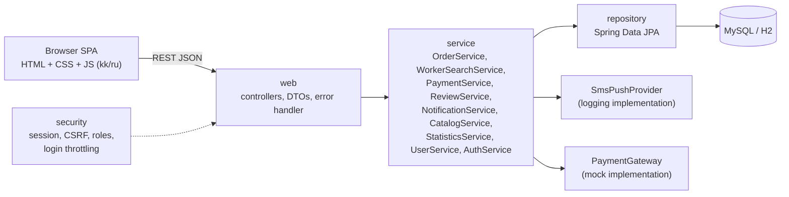
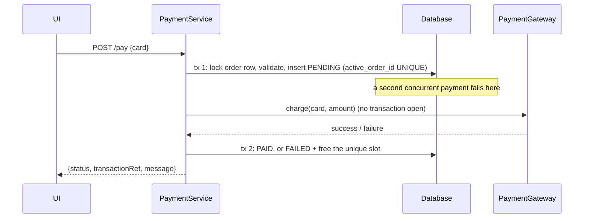
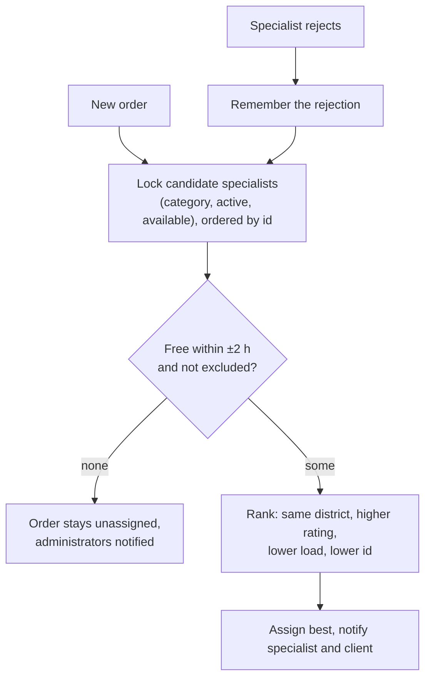

# Architecture

## Layers

```mermaid
flowchart LR
    UI["Browser SPA<br/>HTML + CSS + JS (kk/ru)"] -->|REST JSON| C["web<br/>controllers, DTOs, error handler"]
    C --> S["service<br/>OrderService, WorkerSearchService,<br/>PaymentService, ReviewService,<br/>NotificationService, CatalogService,<br/>StatisticsService, UserService, AuthService"]
    S --> R["repository<br/>Spring Data JPA"]
    R --> DB[("MySQL / H2")]
    S --> SMS["SmsPushProvider<br/>(logging implementation)"]
    S --> PAY["PaymentGateway<br/>(mock implementation)"]
    SEC["security<br/>session, CSRF, roles,<br/>login throttling"] -.-> C
```

## Payment flow (three short steps, no long transaction around the gateway)

```mermaid
sequenceDiagram
    participant UI
    participant PS as PaymentService
    participant DB as Database
    participant GW as PaymentGateway
    UI->>PS: POST /pay {card}
    PS->>DB: tx 1: lock order row, validate, insert PENDING (active_order_id UNIQUE)
    Note over DB: a second concurrent payment fails here
    PS->>GW: charge(card, amount)  (no transaction open)
    GW-->>PS: success / failure
    PS->>DB: tx 2: PAID, or FAILED + free the unique slot
    PS-->>UI: {status, transactionRef, message}
```

## Specialist assignment

```mermaid
flowchart TD
    A["New order"] --> B["Lock candidate specialists<br/>(category, active, available), ordered by id"]
    B --> C{"Free within ±2 h<br/>and not excluded?"}
    C -- none --> E["Order stays unassigned,<br/>administrators notified"]
    C -- some --> D["Rank: same district, higher rating,<br/>lower load, lower id"]
    D --> F["Assign best, notify specialist and client"]
    G["Specialist rejects"] --> H["Remember the rejection"] --> B
```
