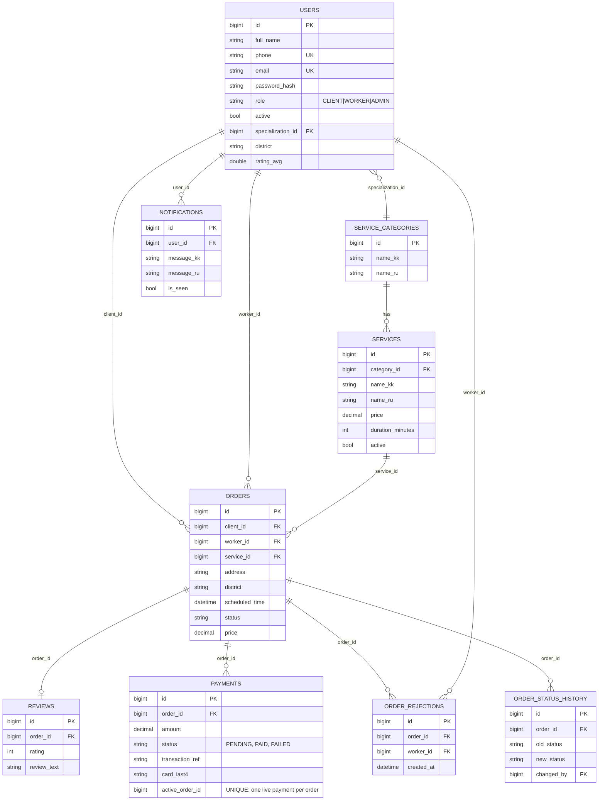

# ER-диаграмма

```mermaid
erDiagram
    USERS ||--o{ ORDERS : "client_id"
    USERS ||--o{ ORDERS : "worker_id"
    USERS }o--|| SERVICE_CATEGORIES : "specialization_id"
    SERVICE_CATEGORIES ||--o{ SERVICES : has
    SERVICES ||--o{ ORDERS : "service_id"
    ORDERS ||--o| REVIEWS : "order_id"
    ORDERS ||--o{ PAYMENTS : "order_id"
    ORDERS ||--o{ ORDER_REJECTIONS : "order_id"
    USERS ||--o{ ORDER_REJECTIONS : "worker_id"
    ORDERS ||--o{ ORDER_STATUS_HISTORY : "order_id"
    USERS ||--o{ NOTIFICATIONS : "user_id"

    USERS { bigint id PK
        string full_name
        string phone UK
        string email UK
        string password_hash
        string role "CLIENT|WORKER|ADMIN"
        bool active
        bigint specialization_id FK
        string district
        double rating_avg }
    SERVICE_CATEGORIES { bigint id PK
        string name_kk
        string name_ru }
    SERVICES { bigint id PK
        bigint category_id FK
        string name_kk
        string name_ru
        decimal price
        int duration_minutes
        bool active }
    ORDERS { bigint id PK
        bigint client_id FK
        bigint worker_id FK
        bigint service_id FK
        string address
        string district
        datetime scheduled_time
        string status
        decimal price }
    REVIEWS { bigint id PK
        bigint order_id FK
        int rating
        string review_text }
    PAYMENTS { bigint id PK
        bigint order_id FK
        decimal amount
        string status "PENDING, PAID, FAILED"
        string transaction_ref
        string card_last4
        bigint active_order_id "UNIQUE: one live payment per order" }
    ORDER_REJECTIONS { bigint id PK
        bigint order_id FK
        bigint worker_id FK
        datetime created_at }
    NOTIFICATIONS { bigint id PK
        bigint user_id FK
        string message_kk
        string message_ru
        bool is_seen }
    ORDER_STATUS_HISTORY { bigint id PK
        bigint order_id FK
        string old_status
        string new_status
        bigint changed_by FK }
```
